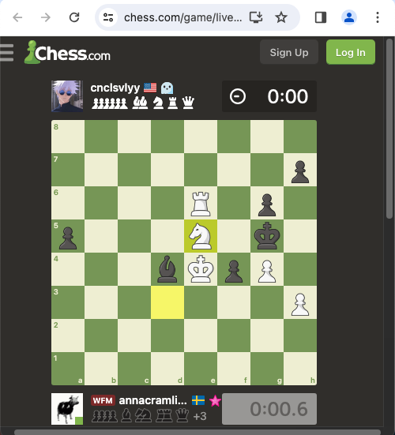

# Features

## Import Custom Repertoires

You can upload any set of lines you want to learn. Learning the Scandinavian Wombat Attack like everyone else? Prepare your PGN with the lines you want from that opening and you can use it with this site. 

## Review your games

Once you pick your repertoire and import your games from chess.com, you can see where the games left your repertoire lines. By default, this list only shows you the games where you played a different move than the repertoire. This allows you to quickly identify the gaps in your knowledge.

In each of the images, the site puts a green arrow on the move you should have played, and a red arrow on the move that you played instead.

Now that you know where to focus, you can run drills in the drills tab to practice the moves where you left the repertoire. Or, you can access one of the links under the board.

https://github.com/macacollins/book-it/assets/5402373/038362a5-be3e-45a0-aa63-cd28f9cdcf48

## Drills

You can practice the lines that you missed by going to the drills tab. The board will play through the first few moves. Then, it's your turn to try again where you missed last time.

https://github.com/macacollins/book-it/assets/5402373/e0f252db-c9ea-4b24-a22c-3fd35a4b5795

## External links

Here's a list of things the app links to other sites for rather than attempt to re-implement:

- Viewing the rest of the game (Links to chess.com instead)
- Analyzing positions (Links to Lichess instead)
- Educating you about Chess openings (Links to Chessable instead)

These links are under each game in the list.

### Chess.com

This link takes you to the game itself so that you can look over what happened and use any other chess.com features you want.

### Lichess

This link takes you to an analysis board at the position where you played the different move. 

https://github.com/macacollins/book-it/assets/5402373/611cd483-a6b7-43fb-a626-1e8cd5bc733e

You can compare moves, access web-based Stockfish 16, and see Lichess statistics here.

### Chessable

This link takes you to a Chessable position search. This will return a list of any courses that have the position where you played a different move from the repertoire. 

If you have a course that includes the line from your game, you can click it to access a list of matching lines in the Chessable course. This lets you quickly find reference material in Chessable.

If you played a game and didn't have any idea what to do at the position where you left the repertoire, you can check Chessable courses to learn from an expert.

https://github.com/macacollins/book-it/assets/5402373/feb82626-8fd8-407d-8cb2-1b97cb9a1381

## Client-side only

This application is free and there is no server interaction other than loading static assets such as JS, HTML, and CSS. It is hosted from this repository directly on GitHub at [https://macacollins.github.io/book-it/](https://macacollins.github.io/book-it/)

# Try it out!

You can try the application [here](https://macacollins.github.io/book-it/). There is default data that will allow you to click through the UI. You can click the Games or Drill tabs to get started.

## Using Custom Repertoires

To get feedback for the games you play and the lines you want to play, you will need a few things:

### 1. A chess.com username

You will need to enter your own chess.com username.

### 2. Repertoire PGN file

Enter something for the Repertoire Name field, then select a file. The application does not handle variations at the current time, so each game needs a separate line in the PGN file. Variations will not be parsed into the lines database.

### 3. Reset analysis

You will need to click Reset Analysis Database.

### 4. Import Games

Next, you need to navigate to the Games tab. Then click Reset Games to load games for your username from chess.com.
